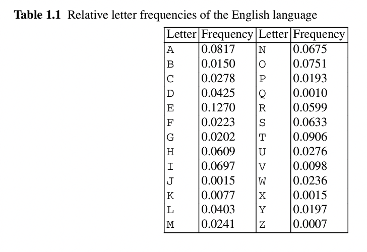

**1.The ciphertext below was encrypted using a substitution cipher. Decrypt the ciphertext without knowledge of the key.**

> lrvmnir bpr sumvbwvr jxbpr lmiwv yjeryrkbi jxqmbm wi bpr xjvni mkd ymibrut jx irhx wibpr riirkvr jx ymbinlmtmipw utnqmumbr djw ipmhh butbj rhnvwdmbr bpr yjeryrkbi jx bprqmbm mvvjudwko bj ytwkbrusurbmbwjk lmird jkxjubt trmui jx ibndt wbwi kjb mkrmit bmiq bjrashmwk rmvp yjeryrkb mkd wbi iwokwxwvmkvr mkdijyr ynib urymwk nkrashmwkrd bjower m vjyshrbr rashmkmbwjk jkr cjnhd pmer bjlr fnmhwxwrd mkd wkiswurd bj invpmk rabrkb bpmb pr vjnhd urmvp bpribmbr jx rkhwopbrkrd ywkd vmsmlhr jx urvjokwgwko ijnkdhrii ijnkd mkdipmsrhrii ipmsr wdj kjb drry ytirhx bprxwkmh mnbpjuwbt lnb ytrasruwrkvr cwbp qmbm pmi hrxb kjdjnlb bpmb bpr xjhhjcwko wibpr sujsru msshwvmbwjk mkd wkbrusurbmbwjk wjxxru ytbprjuwri wkbpr pjsr bpmb bpr riirkvr jxjqwkmcmk qmumbr cwhh urymwk wkbmvb

**2.Compute the relative frequency of all letters A...Z in the ciphertext.You may want to use a tool such as the open-source program CrypTool[50]forthistask. However,a paper and pencil approach is also still doable.**

**2.Decrypt the cipher text with the help of the relative letter frequency of the English language(see Table1.1 in Sect.1.2.2).
Note that the text is relatively shortand that the letter frequencies in it might not perfectly align with that of general English language from the table.** 

**3.Who wrote the text?**

**--- For the answers, run the command: 'node problem1.1.js' ---**