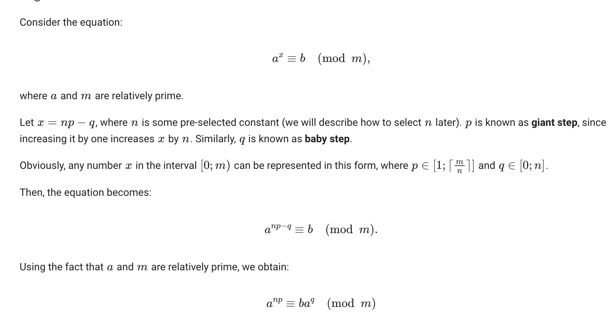

**1.9. Compute x as far as possible without a calculator. Where appropriate, make use of a smart decomposition of the exponent as shown in the example in Sect. 1.4.1:**
**1. x = 3^2 mod 13** = the answer can be found easily as **9**.
**2. x = 7^2 mod 13** = the answer can be found easily as **10**.
**3. x = 3^10 mod 13**
   3x3x3 = 3^3 = 27 and 27 mod 13 = 1.
   3^3 x 3^3 x 3^3 x 3 mod 13 = 1x1x1x3= **3**
**4. x = 7^100 mod 13**
 To solve this question, we need to find a pattern that gives '1' as a result to easy the solution.
   7x7x7 mod 13 = 5 
   (7^3)^33 x 7 = 5^33 x 7
   5x5x5x5 mod 13 = 1. 
   (5^4)^8 x 5 x 7 mod 13 = 35 mod 13 = **9** 

**5. 7^x = 11 mod 13**
The last problem is called a discrete logarithm and points to a hard problem which
we discuss in Chap. 8. The security of many public-key schemes is based on the
hardness of solving the discrete logarithm for large numbers, e.g., with more than
1000 bits.

 We can use trial and error or other methods like the baby-step giant-step algorithm or the Shank's algorithm. Solution via baby-step giant-step algorithm: 

 

 7^1 mod 13 = 7
 7^2 mod 13 = 10
 7^3 mod 13 = 5
 7^4 mod 13 = 9
 7^5 mod 13 = 11
 7^6 mod 13 = 12

 For inverse of 7 mod 13:
 7^(-1) mod 13 = 2
 7^(−2) mod 13= 4
 7^(−3) mod 13= 8
 7^(−4) mod 13= 3

Multiplications by 11: 
 11x 7^(-1) mod 13 = 9

 We already got a match. So, we can stop here.
  7^4 mod 13 = 9 and  11x 7^(-1) mod 13 = 9 has the same result.

  7^4 = 11x 7^(-1)
  7^5= 11 mod 13 
  So the 'x' here is **5**. 

